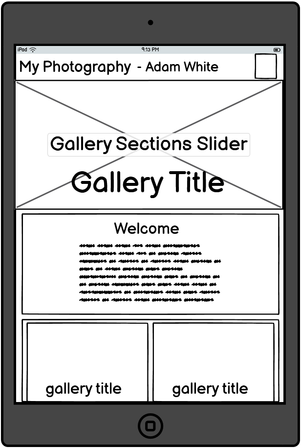
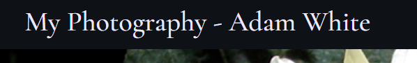
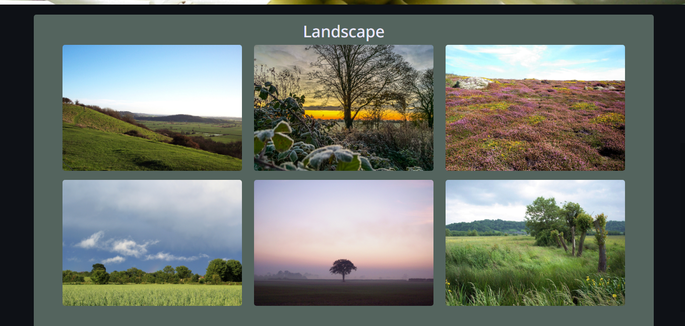
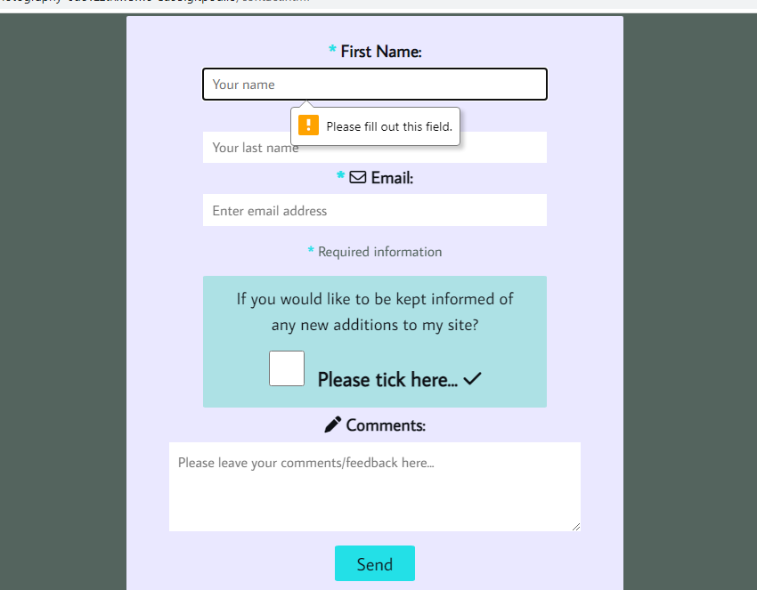

# My Photography - Adam White

This website is for people to visit in order to view and enjoy a range of photographs, which have been taken by myself.

My photography has been a hobby and past-time I have enjoyed over the years, and continue to do so.
So I want to create a place for people to go and to enjoy what I've captured and created over time.

The audience I am expecting/targeting will consist mainly of family, friends and people I already know. 
And just in general, to expect anyone that may like to view my photographic collection.

Therefore, I have chosen to name it, "My Photography - Adam White". 

!!!!!!!Add an image of the finished site here.

!!!!Add a link to the live site here!!!

Add shield badges here!!

## User Experience (UX)

My intention is to create a visually pleasing website for my visitors to experience.

I would like for people to easily navigate throughout the different pages of the site.

I would like for people to easily select a category of photography to look through and enjoy.

I would like them to want to return to my site again, in the future, as new photographs are added to my gallery.

So, I would like to have a comments/feedback form, along with the possiblity for them to opt into receiving notification
of any new photographic additions I have made to the galleries.

I would also like a page, where I can provide information, as to a little about myself and my photography.

I would like the potential for users to be able to connect via social media. 

## User Stories
### New Site Users

As a new site user, I would like to find a range of photographs, so that I can enjoy looking through them.

As a new site user, I would like to view a specific type of photographic category.

As a new site user, I would like to leave a comment/feedback in relation to the general photographic content within the website.

As a new site user, I would like to be able to make a request for notification of any further photographic additions in the future.

### Returning Site Users

As a returning site user, I would like to know of any new additions to the galleries, so that I can enjoy looking at them.

## Design

### Colour Scheme

I have chosen a fairly monochromatic group of colours. Which has helped to provide good contrast, so I can promote the photographic content being displayed. To maximise the colours within them, and not 'fight' against the colours of the site itself.
I've selected to use a vibrant blue to act as a high light. Eye catching without being over bearing. 

- `eae8ff` used for primary text.
- `#23e0e7` used for primary highlights.
- `#eae8ff` used for secondary text.
- `#ade1e5` used for secondary highlights.
- `#0e1116` used for primary background.
- `#54645e` used for secondary background.
- `#eae8ff` used for optional secondary background.

I have used [coolors.co](https://coolors.co/eae8ff-54645e-0e1116-23e0e7-ade1e5) to generate my colour palette.

 

### Typography

- [Cormorant Garamond](https://fonts.google.com/specimen/Cormorant+Garamond) was used for the primary site name.

- [Open Sans](https://fonts.google.com/specimen/Open+Sans) was used for the primary headers and titles.

- [Average Sans](https://fonts.google.com/specimen/Average+Sans) was used for all other secondary text.

- [Font Awesome](https://fontawesome.com) icons were used, such as the social media icons in the footer.

 

### Imagery

All of the photographs/images used throughout the site are of my own creation.
All rights to use them are my own. 

### Wireframes

To follow best practice, wireframes were developed for mobile, tablet, and desktop sizes.
I've used [Balsamiq](https://balsamiq.com/wireframes) to design my site wireframes.

### Home Page Wireframes

| Size | Screenshot |
| --- | --- |
| Mobile |  |
| Tablet |  |
| Desktop |  |

### Gallery Page Wireframes

| Size | Screenshot |
| --- | --- |
| Mobile |  |
| Tablet |  |
| Desktop |  |

### Profile Page Wireframes

| Size | Screenshot |
| --- | --- |
| Mobile |  |
| Tablet |  |
| Desktop |  |

### Contact Page Wireframes

| Size | Screenshot |
| --- | --- |
| Mobile |  |
| Tablet |  |
| Desktop |  |

### Existing Features

** Feature #1
    - A simple, effective, high contrast logo. Clearly identifying the sites purpose and originator of site content. 

**Feature #2

    - A main navigation system, for the entire site. Also, features a drop down menu for gallery selection.

**Feature #3

    - The site features a visually pleasing, clear, well structured design. With a large hero image, to draw the user's attention.  

**Feature #4

    - A home page with title and text area, to allow for an introduction.
	Below this, a representation of the different categories of gallery for the user to select from. 

  
**Feature #5

    - The gallery pages themselves, feature all available photographs to view within that category. Set out in a clear, easy to see layout.

**Feature #6

    - Each image that the user would like to view. Opens its own modal within the gallery page itself and displays a large photograph with title.

**Feature #7 

    - A profile page. With three different text display sections. Representing different information eg. History, Cameras and future expectations.

**Feature #8 

    - A contact page featuring a form, allowing the viewer to send feedback/comments.
	 With an option to tick a checkbox to be informed of future photographic additions.
	This form also includes validation, required for first name, last name and email address. 

**Feature #9

    - A footer, containing links to different social media platforms. 

### Future Implementations

Sign Up to a mailing list. Informing people of any new additions to the site. 

### Accessibility

typeface used. 
contrasting colours.
screen reader users considered.

## Technologies Used

### Languages Used

HTML and CSS.
JavaScript will be implemented, but via its usage within the boundries of Bootstrap.

### Frameworks, Libraries & Programs Used

amiresponsive
coloors.co
fontjoy
google fonts
googel dev tools
gitpod
git
github
shields.io
balsamiq

## Deployment & Local Development

### Deployment

instructions of how to deploy 

### Local Development

#### How to Fork

add instructions to fork project

#### How to Clone

add instructions to clone project 

## Testing

W3C validation for html and css.

## Credits

### Code Used

Reference any code I may use.

### Content

I am the sole contributor to the development of this website.

### Media

All images used throughout the site have been provided by myself.
  
### Acknowledgments

Thank you to all that have helped me. 
name
name
name
