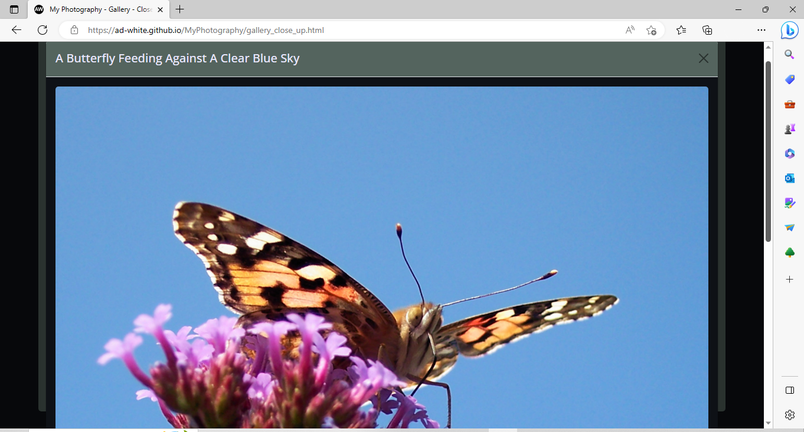
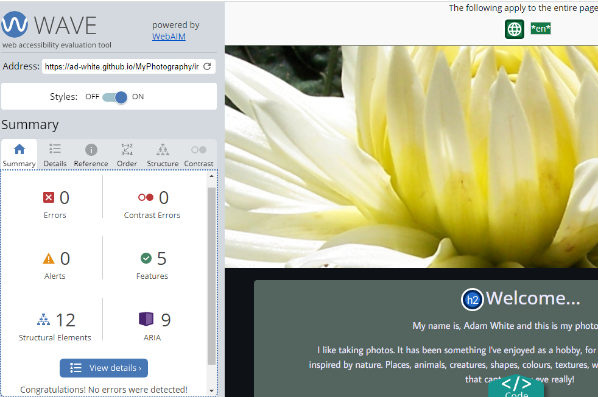
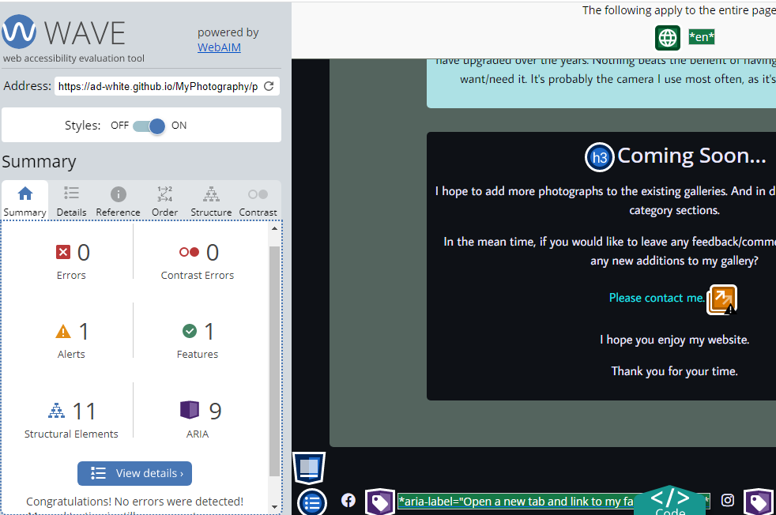

# Testing

Return back to the [README.md](README.md) file.

## Code Validation

### HTML

I have used the recommended [HTML W3C Validator](https://validator.w3.org) to validate all of my HTML files.

| Page | W3C URL | Screenshot | Notes |
| --- | --- | --- | --- |
| Home | [W3C](https://validator.w3.org/nu/?showsource=yes&doc=https%3A%2F%2Fad-white.github.io%2FMyPhotography%2Findex.html) |  | Pass |
| Gallery - Landscape | [W3C](https://validator.w3.org/nu/?showsource=yes&doc=https%3A%2F%2Fad-white.github.io%2FMyPhotography%2Fgallery_landscape.html) |  | Pass |
| Gallery - Sea And Sand | [W3C](https://validator.w3.org/nu/?showsource=yes&doc=https%3A%2F%2Fad-white.github.io%2FMyPhotography%2Fgallery_sea_and_sand.html) |  | Pass |
| Gallery - Digital | [W3C](https://validator.w3.org/nu/?showsource=yes&doc=https%3A%2F%2Fad-white.github.io%2FMyPhotography%2Fgallery_digital.html) |  | Pass |
| Gallery - Close Up | [W3C](https://validator.w3.org/nu/?showsource=yes&doc=https%3A%2F%2Fad-white.github.io%2FMyPhotography%2Fgallery_close_up.html) |  | Pass |
| Profile | [W3C](https://validator.w3.org/nu/?showsource=yes&doc=https%3A%2F%2Fad-white.github.io%2FMyPhotography%2Fprofile.html) |  | Pass |
| Contact | [W3C](https://validator.w3.org/nu/?showsource=yes&doc=https%3A%2F%2Fad-white.github.io%2FMyPhotography%2Fcontact.html) |  | Pass |
| Thank You Page | [W3C](https://validator.w3.org/nu/?showsource=yes&doc=https%3A%2F%2Fad-white.github.io%2FMyPhotography%2Fthankyou.html) |  | Pass |

### CSS

I have used the recommended [CSS Jigsaw Validator](https://jigsaw.w3.org/css-validator) to validate my CSS file.

| File | Jigsaw URL | Screenshot | Notes |
| --- | --- | --- | --- |
| style.css - testing by URL | [Jigsaw](https://jigsaw.w3.org/css-validator/validator?uri=https://ad-white.github.io/MyPhotography/) |  | Errors/Warnings related to framework/bootstrap |
| style.css - direct input validation | --- |  | Pass: No Errors |

## Browser Compatibility

I've tested my deployed project on multiple browsers to check for compatibility issues.

| Browser | Home | Gallery | Gallery Modal | Profile | Contact | Thank you page | Notes
| --- | --- | --- | --- | --- | --- | --- | --- |
| Chrome |  |  |  |  |  |  | Works as expected |
| Safari |  |  |  |  |  |  | Works as expected. Minor styling difference relating to check-box size on contact page |
| Firefox | |  |  |  |  |  | Works as expected | Minor css issue with portrait photograph, multiple rotations on mobile device.
| Edge |  |  |  |  |  |  | Works as expected |

## Responsiveness

I've tested my deployed project on multiple devices to check for responsiveness issues.

| Device | Home | Gallery | Gallery Modal | Profile | Contact | Thank you | Notes |
| --- | --- | --- | --- | --- | --- | --- | --- |
| Mobile |  |  |  |  |  |  | Works as expected |
| Mobile - Horizontal|  |  |  |  |  |  | Works as expected |
| Tablet (DevTools) |  |  |  |  |  |  | Works as expected |
| Tablet (DevTools) - Horizontal |  |  |  |  |  |  | Works as expected |
| Desktop |  |  |  |  |  |  | Works as expected |

## Lighthouse Audit

Initial testing showed performance related warnings for both mobile and desktop. Mainly in relation to the size of the hero-image.
As my response, I resampled the hero-image to a smaller resolution for desktop use. Then I created another smaller version of the hero image and added a media query to control it's use on smaller devices.
I also created a second set of smaller images for use in the gallery sections area on the homepage. I also created smaller images for use within each gallery display area. 

In order to improve upon the inital test results. It was recommended to include meta data for the pages of the site. Also, to make the social media links more 'meaningful'.
I acheived this by adding the recommended meta data, and by adding aria-labels to the fontawesome icons assocciated with the social media links.

I've tested my deployed project using the Lighthouse Audit tool to check for any major issues.

| Page | Size | Screenshot | Notes |
| --- | --- | --- | --- |
| Home | Mobile |  | No warnings |
| Home | Desktop |  | No warnings |
| Gallery - Landscape | Mobile |  | Performance related warnings, due to large images |
| Gallery - Landscape | Desktop |  | No warnings |
| Gallery - Sea And Sand | Mobile |  | Performance related warnings, due to large images |
| Gallery - Sea And Sand | Desktop |  | No warnings |
| Gallery - Digital | Mobile |  | No warnings  |
| Gallery - Digital | Desktop |  | No warnings |
| Gallery - Close Up | Mobile |  | No warnings  |
| Gallery - Close Up | Desktop |  | No warnings  |
| Profile | Mobile |  | No warnings |
| Profile | Desktop |  | No warnings |
| Contact | Mobile |  | No warnings |
| Contact | Desktop |  | No warnings |
| Thank You | Mobile |  | No warnings |
| Thank You | Desktop |  | No warnings |

## Wave Testing

Initial test results relating to the homepage. Suggested making a paragraph element into a heading element, to clarify its purpose. 

 - I have since changed the `p` element into an `h2` element.

Initial test results relating to the contact page. Suggested making an improvement to the contrast of the symbol used for 'required information'.

 - I have now changed the colour used for the required (*) symbol.

I've tested my deployed project using WAVE, [Web Accessibility Evaluation Tool](https://wave.webaim.org) to check for any major issues.

| Page | Screenshot | Notes |
| --- | --- | --- |
| Home |  | No errors were detected |
| Gallery - Landscape |  | No errors were detected  |
| Gallery - Sea And Sand |  | No errors were detected  |
| Gallery - Digital |  | No errors were detected  |
| Gallery - Close Up |  | No errors were detected  |
| Profile |  | Pass : with 1 alert. Redundant link. Adjacent links go to the same URL.|
| Contact |  | No errors were detected |
| Thank You |  | Pass : with 1 error. Relating to redirect function |

## User Story Testing

| User Story | Screenshot - example |
| --- | --- |
| As a new site user, I would like to find a range of photographs, so that I can enjoy looking through them. |  
| As a new site user, I would like to view a specific type of photographic category. |  |
| As a new site user, I would like to leave a comment/feedback in relation to the general photographic content within the website. |  |
| As a new site user, I would like to be able to make a request for notification of any further photographic additions in the future. |  |
| As a returning site user, I would like to know of any new additions to the galleries, so that I can enjoy looking at them. |  |

## Bugs

**Bug 01**
- Strange 'jumping' out of position navbar related behaviour. During the development of the site structure, implementing and styling the bootstrap navbar. When opening or collapsing the navbar element, it would jump out of position.
  
- To fix this, it was necessary to correct a div tag related positioning error, relating to the header and navigation element. It was also necessary to apply a class of `me-auto` to the div with `id="logo"`. Also, to add `ms-auto` within the `ul` element of the the navbar dropdown menu. 

**Bug 02**
- Photographs in a portrait format would require a lot of vertical scrolling in order to see the entire image when viewed on a desktop. I wanted to have the photographs scale to fit somewhere closer to the confines of the users display.
  
- To fix this I made a css class to target any portrait images. The fix can be seen in this screenshot...

**Bug 03**
- Relates to Bug 02. The portrait images display larger than the confines of the modal. Giving an enlarged appearance within the modal itself. Resulting in users viewing on a desktop, using Safari or Firefox unable to see the entire photograph.
Tests conducted using Safari and Firefox on a mobile device produce the same behaviour when in a horizontal orientation.

 
  
- To fix this, I added `object-fit: contain` to the class `modal-photo-portrait`.

| Device | Safari | Firefox | 
| --- | --- | --- |
| Mobile |  |  |
| Desktop |  |  |

**Bug 04**
- Relates to Bug 03. Modal positoning with portrait photos on mobile device, using Firefox. When testing this only seems to occur if the device is rotated a number of times. The photograph retains its ratio within the modal. Yet the modal re-sizes itself slightly smaller and to the left of the screen, rather than center.

 

**Bug 05**
-   Hero image over flows within browser window, removing scroll bar. Throughout testing this seems to occur randomly, so was difficult to capture. Effects google chrome on desktop. Safari when testing on a Macbook, (however, with touch pad it doesn't offer any user issues).

 
  
- To fix this, I experimented with the overflow properties in css, so far with no success.

Early tests from running html and css validation checks, resulted in a couple of errors and a few warnings.

**Error 01**
- Bad value true for attribute required on element input.

- To fix this, I removed the ="true" attribute from the input elements.

**Error 02**
- The value of the for attribute of the label element must be the ID of a non-hidden form control.

- To fix this, I renamed the label for check-box to match the name used as the input id.

**Warning 01**
- Warning The document is not mappable to XML 1.0 due to two consecutive hyphens in a comment. 

- To fix this, I changed the format of my comments.

**Warning 02**
- Warning Section lacks heading. 

- To fix this, I changed the the section to a div element.

**Warning 03**
- Warning Consider using the `h1` element as a top-level heading only. 

- To fix this, I changed the heading `h1` within the modals of the gallery pages to an `h2` element instead. Leaving only one `h1` element per page for the logo.
	

**Fixed Bugs, Errors and Warnings**

| Bug | Status |
| --- | --- |
| [ Bug 01 ] - Strange 'jumping' out of position, navbar related behaviour. | Bug fixed |
| [ Bug 02 ] - Photographs in a portrait format would require a lot of vertical scrolling. | Bug fixed |
| [ Bug 03 ] - The portrait images display larger than the confines of the modal. | Bug fixed |
| [ Error 01 ] - Bad value true for attribute required on element input. | Error no longer exists |
| [ Error 02 ] - The value of the for attribute of the label element must be the ID of a non-hidden form control. | Error no longer exists |
| [ Warning 01 ] - The document is not mappable to XML 1.0 due to two consecutive hyphens in a comment. | Corrected -  Warning not longer exists |  
| [ Warning 02 ] - Section lacks heading. | Corrected -  Warning not longer exists | 
| [ Warning 03 ] - Consider using the h1 element as a top-level heading only. | Corrected -  Warning not longer exists |

## Unfixed Bugs, Errors and Warnings

**Bug 04**
- Relates to Bug 03. Modal positoning problem with portrait photos on mobile device, using Firefox. When testing this only seems to occur if the device is rotated a number of times. The photograph retains its ratio within the modal. Yet the modal re-sizes itself slightly smaller and to the left of the screen, rather than center.

- Fixing this bug is more about aesthetics and continuity across browsers. As it has no detrimental effect to the users experience, and is also caused by non-expected unusual rotational behaviour. I am happy to leave this at present. Further research is required.

**Bug 05**
- Hero image over flows within browser window, removing scroll bar. Throughout testing this seems to occur randomly, so was difficult to capture. Effects google chrome on desktop. Safari when testing on a Macbook (however, with touch pad it doesn't offer any user issues).

 
  
- To fix this, I experimented with overflow properties using css, with no success to date.

- Whenever I have encountered this bug. Scrolling can still be achieved through keyboard commands, "page up/down". Refreshing the page or clicking on another page within the site and back again; has caused the vertical scroll bar to re-appear. Further research is required.

Any remaining errors or warnings to my knowledge, are as a result of the valitading software, trying to validate external libraries and/or frameworks.

There are no remaining bugs that I am aware of.
